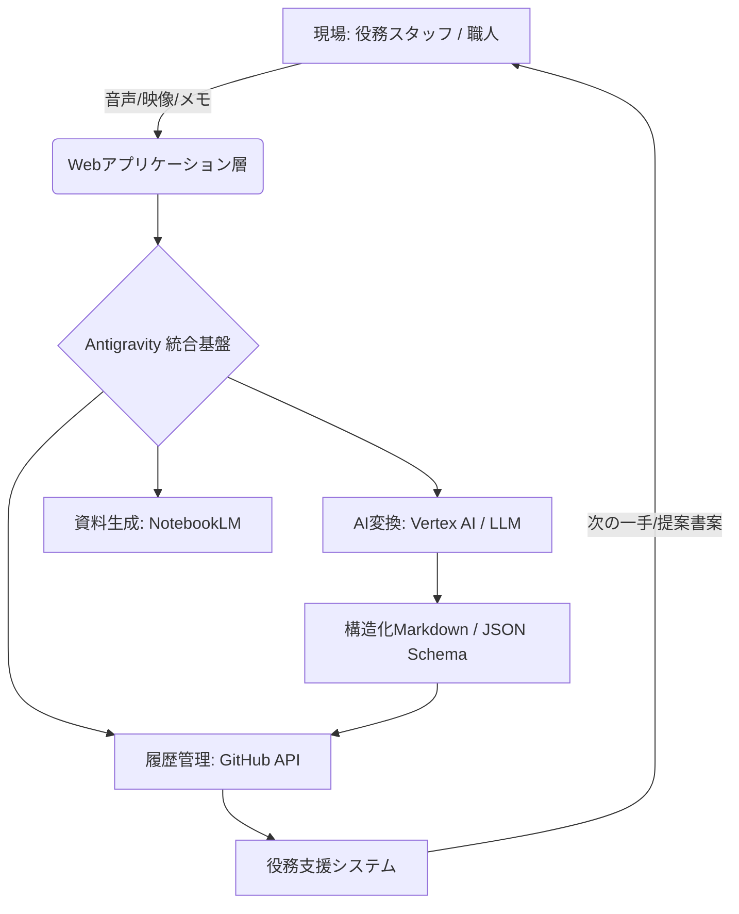

# Heritage-OS システムアーキテクチャ設計

## 1. 概要

本システムは「役務スタッフがいかに効率よく、高い精度で暗黙知を構造化できるか」に特化して設計されている。GitHubによる履歴管理とNotebookLMによる生成能力を中核に据えたAntigravity基盤である。

## 2. コア機能 (10のIT機能)

| カテゴリ | 機能ID | 機能名称                         | 概要                                                              |
| :------- | :----- | :------------------------------- | :---------------------------------------------------------------- |
| **収集** | 1      | **マルチモーダル・インテーク**   | 動画・音声・手書きメモ等の統合アップロードとメタデータ自動付与。  |
|          | 2      | **現場リアルタイム・ロギング**   | インタビュー中の重要ポイントへのリアルタイムタグ付け。            |
| **変換** | 3      | **AI文脈構造化エンジン**         | [判断理由][感情][法的根拠]の自動分類と構造化。                    |
|          | 4      | **GitHub連携同期 (Mirroring)**   | Web上のナレッジをMarkdownとしてGitHubへ自動コミット・双方向同期。 |
| **分析** | 5      | **セマンティック・ナレッジ検索** | 意味検索による類似事例や動画シーンへのダイレクトアクセス。        |
|          | 6      | **スキル・カバレッジ可視化**     | 組織のナレッジ保有状況と消失リスクのヒートマップ化。              |
| **生成** | 7      | **NotebookLM資料生成API**        | 後任者向けガイドやQ&Aボットの自動生成。                           |
|          | 8      | **政策シミュレーター**           | 過去のアンチパターンに基づく新施策のリスク評価。                  |
| **管理** | 9      | **階層型アクセス・ガバナンス**   | 自治体・部署単位の権限管理とマスキング処理。                      |
|          | 10     | **ナレッジ・ライフサイクル管理** | 情報の陳腐化検知と更新アラート。                                  |

## 3. 役務サービス支援システム

- **A. インタビュー・オーケストレーター**: リアルタイムで「次に聞くべき問い」をスタッフへサジェスト。
- **B. 構造化エディター (Refactoring Tool)**: AI生成データの人間による修正・承認フロー (PRベース)。
- **C. デライト提案・生成エンジン**: 蓄積ナレッジを活用した付加価値提案の自動生成。

## 4. システム構成図 (Architecture Diagram)

## 5. データモデル

`core-os/data-schema/knowledge-schema.json` にて定義。

- **Source Metadata**: 生データソース（音声、場所、撮影者）
- **AI Analysis**: 感情コンテキスト、判断ロジックタグ
- **Git Metadata**: リポジトリ内のパス、コミットハッシュ

この設計により、ITがバックエンドを支え、人間（役務スタッフ）がフロントで価値創出に集中する分業体制を実現する。
